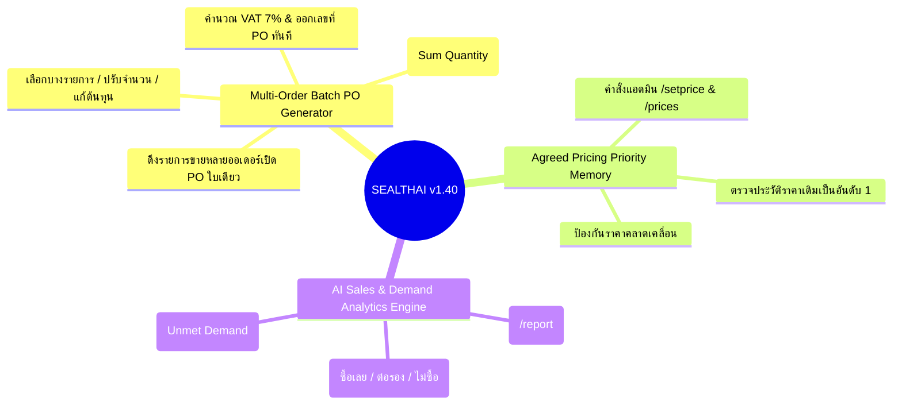

# 📘 SEALTHAI System Manual & Technical Specification (v1.40)
**ระบบบริหารจัดการร้านค้า & ผู้ช่วยอัจฉริยะ AI Omnichannel (SEALTHAI ERP & AI Assistant)**  
*Release Date: 19 สิงหาคม 2026*

---

## 🚀 มีอะไรใหม่ใน SEALTHAI v1.40 (What's New in v1.40)

---

## 1. 🛒 ระบบสร้างใบสั่งซื้อจากรายการขายหลายออเดอร์ (Multi-Order to Single PO Generator)

### 📌 วัตถุประสงค์และการทำงาน:
ช่วยให้ฝ่ายจัดซื้อหรือเจ้าของร้านสามารถรวบรวมรายการสินค้าที่ขายไปแล้วจากบิลหลายๆ ใบ (ไม่ว่าจะเป็น Shopee, Lazada, LINE, Facebook หรือหน้าร้าน) มาเปิด **Purchase Order (PO)** สั่งของจากซัพพลายเออร์ได้ในคลิกเดียว

### ✨ ฟังก์ชันสำคัญ:
1. **การเลือกออเดอร์ (Flexible Multi-Selection):**
   * ติ๊กถูกที่ช่อง Checkbox หน้ารายการออเดอร์ในหน้า **รายการออเดอร์ (Orders)** กี่ใบก็ได้
   * กดปุ่มสีเขียว **`🛒 สร้าง PO จากออเดอร์ (X)`** ที่แถบเมนูด้านบน
2. **โหมดการจัดกลุ่มสินค้า (Grouping Mode):**
   * **สวิตช์ `🔄 รวมจำนวนตามรหัส SKU / สินค้าเดียวกัน`:** ระบบจะรวมยอดขายของสินค้าตัวเดียวกันจากหลายออเดอร์เป็นบรรทัดเดียวพร้อมบวกจำนวนให้อัตโนมัติ
   * **แยกตามออเดอร์:** สามารถปิดสวิตช์เพื่อดูรายการแยกตามบิลลูกค้าแต่ละรายได้
3. **การปรับแต่งรายการสินค้า (Item-Level Customization):**
   * **Checkbox รายบรรทัด:** เลือกติ๊กเฉพาะรายการที่ต้องการสั่งซื้อ (รายการไหนมีของในคลังอยู่แล้วสามารถติ๊กออกได้)
   * **ปรับจำนวนสั่งซื้อ (PO Qty):** แก้ไขจำนวนที่ต้องการสั่งซื้อเข้าคลังได้อิสระ
   * **ปรับราคาต้นทุน (Unit Cost):** ดึงราคาต้นทุนล่าสุด (`current_cost`) ให้อัตโนมัติ และพิมพ์แก้ไขราคาได้
4. **สรุปยอดและออกเอกสารทันที:**
   * เลือก Supplier และใส่วันที่คาดว่าจะได้รับของ
   * คำนวณยอดรวมก่อน VAT, VAT 7% (รวมใน/แยกนอก) และยอดสุทธิแบบ Real-time
   * กดสร้าง PO ระบบจะสร้างเลขที่ PO และพาเข้าสู่หน้าพิมพ์ใบสั่งซื้อทันที

---

## 2. 🧠 ระบบตรวจสอบประวัติราคาเดิม (Agreed Pricing Priority Memory)

### 📌 ลำดับความสำคัญในการคิดราคา:
1. **Priority 0 (สูงสุดเสมอ): ตรวจสอบ `admin_pricing_memory`**
   * หากสเปกหรือรหัสสินค้านั้น **เคยคุยราคา หรือเคยให้ราคาพิเศษกับลูกค้าไว้** ระบบจะดึงราคาเดิมมาตอบทันที 100% เพื่อไม่ให้ลูกค้างง
2. **Priority 1: รายการใหม่ที่ไม่เคยตกลงราคาไว้**
   * คำนวณราคาตาม Tiered Pricing
   * เปรียบเทียบกับราคาขายบน Shopee (หากราคาสูงกว่า จะ Cap ให้ถูกกว่า Shopee 10%)
   * ปัดเศษทศนิยมขึ้นเป็นเลขกลมๆ (`math.ceil`)

### 💬 คำสั่งแอดมินบน Telegram (`@sealthai_bot`):
* 📝 **ตั้งราคาเดิม:** `/setprice [สเปกหรือ SKU] [ราคา]` (เช่น `/setprice TC 35-50-8 35`)
* 📋 **ดูรายการราคาเดิมทั้งหมด:** `/prices`

---

## 3. 📊 ระบบจัดเก็บและวิเคราะห์พฤติกรรมการซื้อ (Sales & Demand Analytics Engine)

### 📌 การบันทึกและวิเคราะห์ข้อมูล:
* **ซื้อเลย (Purchased):** เมื่อลูกค้าตอบรับข้อเสนอ (เช่น *"เอาครับ", "ขอเลขบัญชี", "โอนเงิน"*) ระบบจะบันทึกสถานะปิดการขายและยอดเงินทันที
* **ต่อรองราคา (Bargaining):** ตรวจจับคำว่า *"ลดได้ไหม", "ราคาส่งเท่าไหร่"* เพื่อวิเคราะห์ความอ่อนไหวของราคา
* **ขอคิดดูก่อน (Abandoned):** บันทึกรายการที่ลูกค้ายังไม่ซื้อ เพื่อนำมาวิเคราะห์ปรับราคาสินค้า
* **สินค้าขาดสต็อก (Unmet Demand):** บันทึกสเปกและขนาดที่ลูกค้าถามหาแต่ของหมด เพื่อส่งต่อไปยังหน้า **Stock Planning** วางแผนสั่งของเข้าคลัง

### 📲 คำสั่งดูรายงานสำหรับผู้บริหาร:
* 📊 **`/report` หรือ `/analytics`:** ดูสรุป Conversion Rate %, ยอดขายที่ปิดได้, Top 5 สินค้าที่ลูกค้าค้นหาบ่อยที่สุด และสินค้าขาดสต็อกที่ต้องรีบสั่งเพิ่ม

---

## 🛠️ สรุปไฟล์และโครงสร้างทางเทคนิค (Technical Stack)

| ส่วนประกอบ | รายละเอียด |
| :--- | :--- |
| **Frontend Dashboard** | `index.html` (SEALTHAI v1.40, Vanilla JS, ServiceWorker Cache `sealthai-v1.40`) |
| **Database** | PostgreSQL (ตาราง `products`, `orders`, `order_items`, `purchase_orders`, `purchase_order_items`, `admin_pricing_memory`, `customer_deal_analytics`, `unmet_demand_analytics`) |
| **AI Assistant Backend** | FastAPI (`main.py` บน VPS `169.58.151.88:8001`), Docker container `sealthai-api` |
| **Telegram Polling Service** | `tg_polling_worker.py`, Systemd `sealthai-tg.service` |

---

*เอกสารนี้จัดทำขึ้นสำหรับทีมงานและผู้ดูแลระบบ SEALTHAI — เวอร์ชัน 1.40 (19 ส.ค. 2026)*
